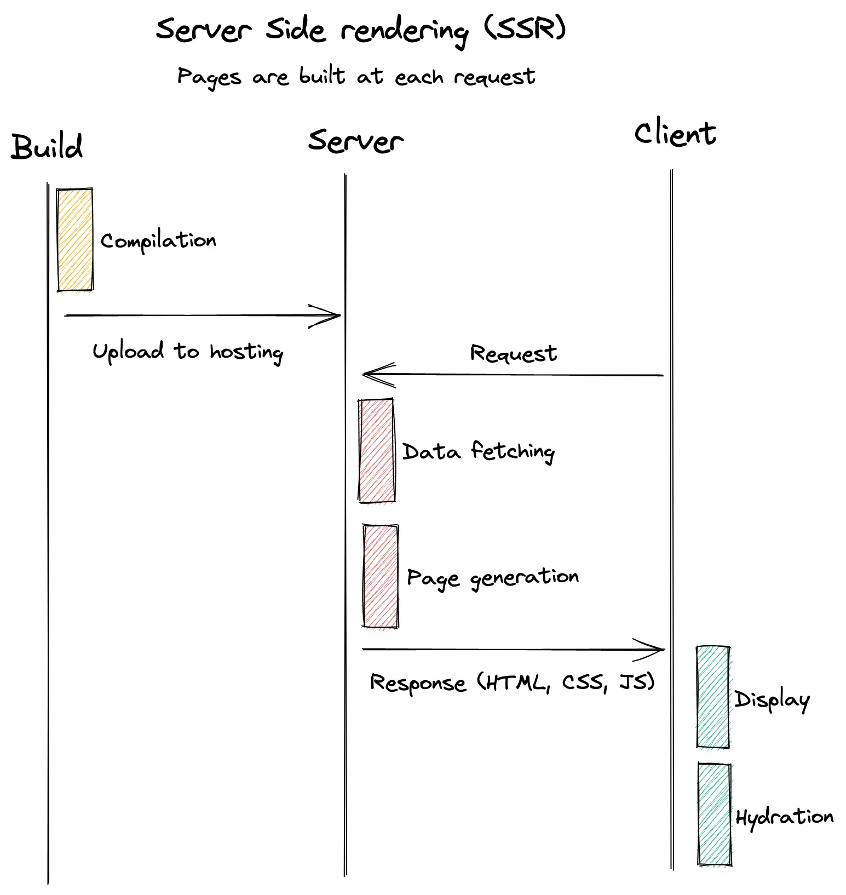
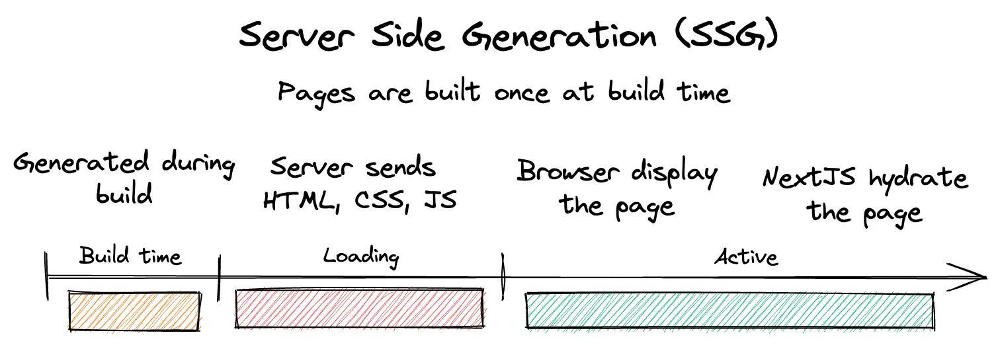
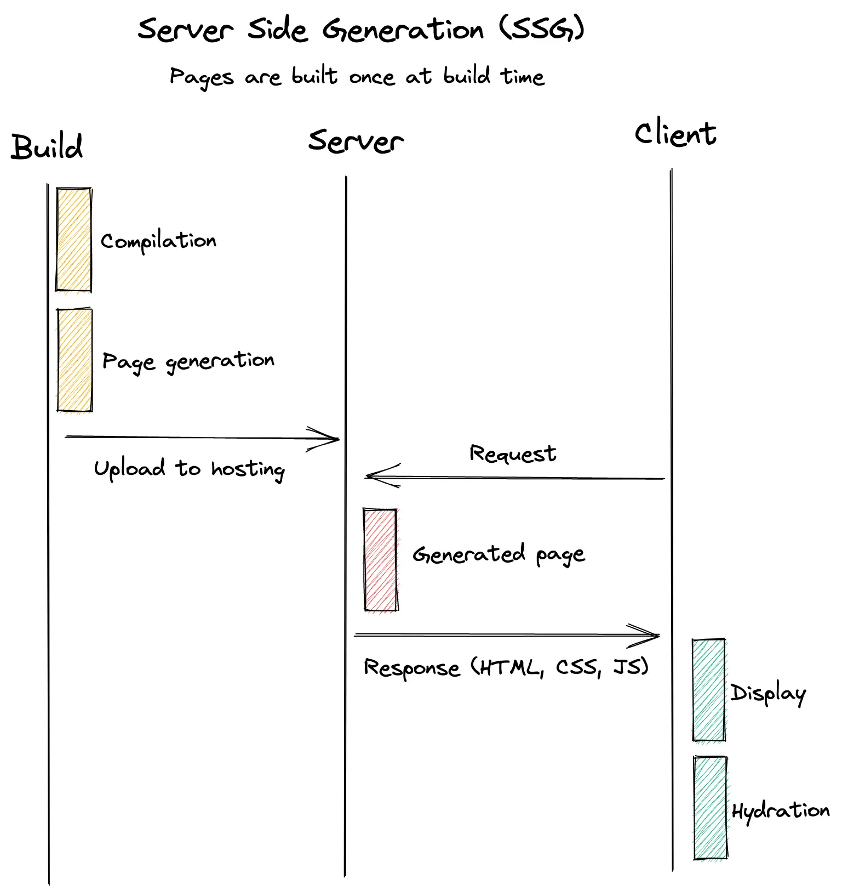
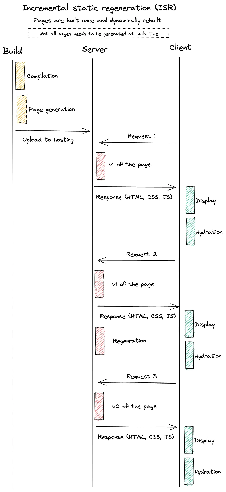

One of the selling points of NextJS is the ability of rendering React pages on a server. This can ensure better performance and make the page SEO friendly meaning that search engine will index your pages.

NextJS offers 3 methods to generate pages on a server, this article will detail the benefits and drawbacks of each strategy to help you choose the appropriate solution for your problem.

**By default React will try to render pages on the server. If the page contains static content, you can assume that it will be statically generated. If your page contains dynamic content, you’ll be able to choose between static generation (SSG) by using the getStaticProps method or server side rendering (SSR) with the getServerSideProps method. If your content can change, you can use Incremental Static Regeneration (ISR) to rebuild pages after a given interval. Each method will be reviewed in the rest of this article.**

> NextJS 13 updates bring a lot of change to the way the pages are built. However, the layout RFC is still in beta at the time of writing. The information of this article is still up-to-date if you’re not using the new layout.

## tl;dr

This article gives many and can be a bit lengthy. Here is a quick summary if you don’t want to read everything.

Data type and stability is the ultimate determining factor when it comes to page building strategies. Understanding how your data can change is what will define the appropriate data-fetching and page-rendering method.

-   All pages without data fetching will be statically rendered
-   If your content doesn’t change, it’s better to use Server Side Generation (SSG). It allows generating pages once (at build time) and great performances. This method is what’s recommended by the NextJS team.
-   If your content change you have two options. The first one is to build the page at each request with Server Side Rendering (SSR), this can slow page speed but ensure that the data is fresh. The second option is to use Incremental Static Regeneration (ISR), it’s a process where pages are cached for a configured about of time and rebuilt once the cache is stale.
-   Fetching data on the server isn’t always required. Statically building a page skeleton and fetching data on the client (using suspense) are also a viable solution in some use cases.

## What’s the issue with React?

React is a front end framework that helps developer build Single Page Application (SPA). This is totally fine for building apps such as Asana or Discord but has its limitation when it comes to SEO and performance.

By default, React app will download a large JavaScript file that contains all the codes (this file is called the bundle) that the browser needs to execute. Only after that the content of the page is displayed to the users. To speed performances it’s possible to split the bundle in multiple smaller files that can be downloaded separately.

As you can imagine, having to download and execute code can take time and is a bad experience for the users. Having to wait is never fun! It would be nice if the server could send just HTML and CSS so the users directly have something to look at. The following diagram shows how this process happens for a classic React application.


In the end that was done by every web technologies before the rise of SPA frameworks such as Angular, React and Vue. This could be seen as a step backwards. Which is true to a certain extent, but it has also allowed the creation of much more complex applications than what was done before.

There are cases where using React Client Side rendering is fine and can be used. However you might face some limits if you want to have a website indexable by search engines or if you need better performances. That’s where frameworks that offers Static Generation comes to play. This article focus on NextJS but other frameworks such as [Gatsby](https://www.gatsbyjs.com/) or [Astro](https://astro.build/) does things in a somewhat similar manner.

## NextJS Server Side Rendering (SSR)

Server Side Rendering (SSR) means that the page users access is generated at each request. Every customer will trigger the generation of a page and won’t share cache or page version with anybody else.

Generating a page at each request can make sense in some scenarios. The nature of data that needs to be displayed is the determining factor. Using SSR can make sense when building an application that has geo-restricted content.

> If the content of the page depends on the request (location, authorization, …) then it makes sense to use SSR.

### How to use SSR

Using SSR is done by using the `getServerSideProps` method on a page. Note that the methods must be placed on the page, placing this method anywhere else won’t work.

```typescript
const Page = ({ data }) => {
    // Render data...
};

// This gets called on every request
export async function getServerSideProps() {
    // Fetch data from external API
    const res = await fetch(`https://.../data`);
    const data = await res.json();

    // Pass data to the page via props
    return { props: { data } };
}

export default Page;
```

The code present in the `getServerSideProps` method will be executed at each request.

### SSR timings


Opening a page that has SSR is as follows:

-   The code in the `getServerSideProps` method is executed and data is fetched.
-   Once the data is fetched, NextJS will generate the page and prepare the assets
-   The bundle in then sent to the browser. The server sends HTML, CSS and JS, this means that the browser is able to directly display the data coming from the server.
-   Once the bundle downloaded, the browser displays the page and everything becomes active;
-   Finally, NextJS needs to hydrate the page. Hydration is the process where React needs to connects the DOM with the virtual DOM it created.

Here is another schema on how the process happens



### Caveats

Even tho this method is supported by NextJS it’s not the one recommended on most cases in the documentation. Unless the nature of data requires generating the page at each request, a state’s approach is more suited in most cases.

Executing the `getServerSideProps` method at each request comes at the cost of speed. The browser won’t receive anything from the server until the method is finished. This blocking time can result in poorer experience for visitors and overall worsen web core vitals.

Besides that, executing code each time requires compute. This compute can be an energy waste if another strategy such as SSG or ISR) is more suited. Even if the free tier of Vercel is quite generous, it’s not an excuse to run code for the sake of it.

## NextJS Server Side Generation (SSG)

Server Side Generation (SSG) means generating the page once, at build time meaning when compiling the project, and using this page for every request until next deployment.

This is the scenario NextJS recommends since it’s the one that offers the best performances but comes at the cost of data freshness. The compiled pages are hosted on CDN ensuring fast response regardless of the location of the location of the visitor.

> If the content of the page can be generated ahead of user’s request, then it makes sense to use SSG

### How to use SSG

By default NextJS will try to statically generate pages. This means that if a page doesn’t have any content part the one from the page (if the content is hardcoded) then the page will be generated at build time.

```typescript
const About = () => {
  return <div>About</div>
}

export default About

```

If page content comes from an external source (a CMS for example) the `getStaticProps` method needs to be used. This means that switching from SSR and SSG is as simple as changing the name of the method that fetches data.

As for SSR, the `getStaticProps` needs to be placed in the page itself and not on any other component. Placing the method anywhere else won’t work.

```typescript
const Blog = ({ posts }) => {
    // Render posts...
};

// This function gets called at build time
export async function getStaticProps() {
    // Call an external API endpoint to get posts
    const res = await fetch("https://.../posts");
    const posts = await res.json();

    // By returning { props: { posts } }, the Blog component
    // will receive `posts` as a prop at build time
    return {
        props: {
            posts,
        },
    };
}

export default Blog;
```

What if the path of the pages depends on the data? Let’s say you’re building a blog. You might want to statically generate the pages so the pages are lightning fast. In that case you might want a URL looking like this `/blog/[slug]`.

NextJS got you covered and you can use the `getStaticPaths` that helps define all the pages to generate. The method returns an array and NextJS will loop over the array and execute the `getStaticProps` of the page for each value in the array.

```typescript
// This function gets called at build time
export async function getStaticPaths() {
    const res = await fetch("https://.../posts");
    const posts = await res.json();

    // Get the paths we want to pre-render based on posts
    const paths = posts.map((post) => ({
        params: { slug: post.slug },
    }));

    return { paths, fallback: false };
}
```

Using `getStaticPaths` allows the generation of all the dynamic pages that are required making it really easy to pre-render all he pages you want.

### SSG timings



Pages that are using SSG are built as follows

-   The project is built
-   While being built all the `getStaticProps` and `getStaticPaths` methods are run.
-   Once the data is fetched, the page is statically built
-   Those pages are uploaded to the hosting service and can be served
-   Visiting one of those pages is fast since everything is ready and there are no blocking times

Here is another schema on how the process happens



### Caveats

Serving statically generated pages is the method NextJS recommends. Building the pages once at build time and serving the same version is a great option.

However, not all pages have static content. Some pages need to update regularly or have live updates of the data. In those use case, SSG is not adapted and other solutions should be used. For regular update ISR is more suited, for live update a mix of SSG and CSR is recommended by Next.

Finally, NextJS always send some JavaScript when serving pages even if they are static. Each SSG page will have HTML, CSS and JS, Next then hydrate the page. The pages are thus bigger and alternative such as Astro is better suited if page size is critical.

## NextJS Incremental Static Regeneration (ISR)

SSG biggest limitation is its static nature. There are cases where building once isn’t sufficient and updating the page on a regular basis is important.

For that, NextJS supports Incremental Static Regeneration (ISR) that supports rebuilding pages without rebuilding the whole website. Adopting ISR is as simple as adding a parameter to a method!

> If the content of the page can be generated ahead of user’s request but need regular update, then ISR is for you

### How to use ISR

ISR is very similar to SSG, only it can rebuild a page after a given delay. This is why ISR also uses the `getStaticProps` and supports the `getStaticPaths` methods.

The only difference being the `revalidate` parameter in the return of the `getStaticProps`. This number in seconds indicates how much time is required in between builds.

```typescript
export async function getStaticProps() {
  const res = await fetch(‘https://.../posts’)
  const posts = await res.json()

  return {
    props: {
      posts,
    },
    // Next.js will attempt to regenerate the page:
    // - When a request comes in
    // - At most once every 10 seconds
    revalidate: 10, // In seconds
  }
}

```

ISR is very powerful and can be used to incrementally build the pages of a website. Instead of building all pages at each deployment, it’s possible to only build a subset of them (the most popular pages for examples). All the pages that aren’t built will be gradually built as they are visited.

---

Besides that, data on the pages is still fresh and can be updated without any intervention. This also means that all pages will be the same during the cache period configured. There are cases where forcing an update is desired (when the data on a CMS change for example).

On-demand revalidation is a mechanism that allows update of cached pages without having to redeploy a website. An API endpoint is required to make this work. The endpoint should be secured with a secret stored in environment variable to avoid unwanted access.

The method is quite simple and acts as a web hook that can be fired by CMS when an entry is updated. In the method you check the secret, get the path to revalidate and force the revalidation with `res.revalidate`. Once this is done, you can return a 200.

```typescript
// pages/api/revalidate.js
export default async function handler(req, res) {
    // Check for secret to confirm this is a valid request
    if (req.query.secret !== process.env.MY_SECRET_TOKEN) {
        return res.status(401).json({ message: "Invalid token" });
    }

    try {
        // this should be the actual path not a rewritten path
        // e.g. for "/blog/[slug]" this should be "/blog/post-1"
        await res.revalidate("/path-to-revalidate");
        return res.json({ revalidated: true });
    } catch (err) {
        // If there was an error, Next.js will continue
        // to show the last successfully generated page
        return res.status(500).send("Error revalidating");
    }
}
```

### ISR timings


ISR process is quite similar to what SSG do. The only exception is the regeneration that happens once a visitor has triggered it.

The trigger is done when a user visits a page that is older than the configured time in the `validate` parameter. **This user will still get the old version of the page** and the following user will get the updated one.

The rebuilding process is non-blocking and happens in the background. Users won’t even notice that the page updated.



### Caveats

ISR takes some of the limitation SSG has and fix them by assuring a page that has fresh data. However, the data can get stale if it updates. Two options are then possible, either use on-demand revalidation or switch to CSR.

Using on-demand revalidation is useful if the data doesn’t update too frequently or isn’t live. It makes sense to keep ISR and fast page speeds while forcing cache purging. If the data gets updated frequently, using a mix of SSG and CSR is an option. Part of the application can be statically generated and, using suspense, the data can be fetched from the client with a nice loading animation. Another option is to use SSR and fetch up -to-date information before rendering the page.

## Conclusion

NextJS offers many ways to manage page building. There is a scenario for every need depending on the type of data you want to display.

The goal of this article was to review the currently supported methods. Things will dramatically change with the new layout but this feature is still in beta. I would recommend sticking with the current way of doing things as long as there is no stable release.

I didn’t discuss about the edge and how middleware and other NextJS features can benefit from it. This is something that I intend to work on a separate article.

I hope you found this information useful and now have a better understanding of the way pages are built in NextJS.
