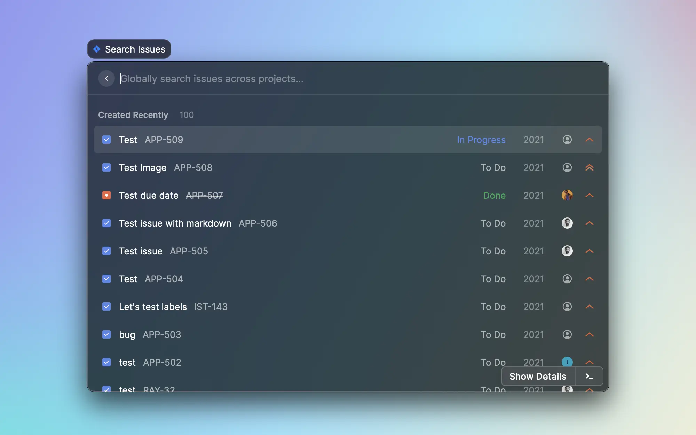
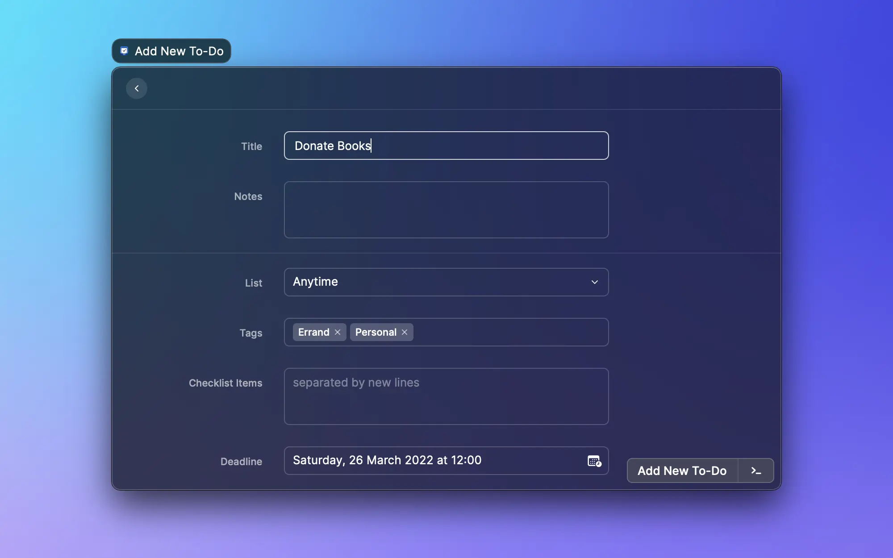
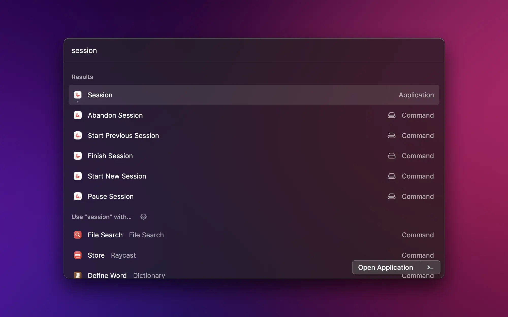

The default macOS Spotlight feature get enhanced each year. Recently, it can give better web result and files can be previewed with the quick.

These additions are fine, but competitors offer far more than the search and some quick actions. For quite a long time, the default recommendation was Alfred, but I want to argue that a new challenger has entered the room.

## What Is Raycast

In short, Raycast can replace Spotlight. It can do search on the web, find files and open software. You press the CMD+Space key of your keyboard, and it opens. By default, Raycast also offers things that nor Spotlight or Alfred offers. For example, you can manage window position, create snippets, eject disks, change volume, search emojis…

Out of the box, Raycast is already more powerful than both Spotlight and Alfred. This fact alone should be sufficient to make you consider it, but there is more!

### Extensions Store

Alfred has been the reference for quite some time now. What made Alfred great was the workflows. Those workflows can extend what Alfred does. One can control Spotify or send a Slack message right from Alfred.

Users are able to share and download workflows. Allowing anyone to extend what Alfred can do. This is all nice until users want to find workflows or update them.

Alfred’s developers never developed a centralized store where anyone can find other workflows. This led to the creation of a third-party website and an overall poor experience for everyone.

That’s where Raycast excel. They have a store that contains all the extensions developed by people. You can search, install and update the extensions right from Raycast. Gone are the days when you have to download a workflow file from an unknown GitHub.

Currently, the store counts more than 700 workflows. All those workflows are available from the search. Each extension can be customized or given a unique keyboard shortcut for easy access. The offering range from controlling Spotify to killing processes or generating a UUID.

### Some Tips for New Users

There are three things that I want to share to new users of Raycast. Those tips are a great way to better use the software.

-   **Do the tutorial**. Raycast offers a great tutorial, you learn all the keyboard shortcuts that makes you work a lot faster. Raycast ambition is to be used only by keyboard, there is no faster way to interact with a computer, and they created an excellent tutorial for that.
-   **Use CMD+K instead of your mouse**. With time, it’s possible that you forget keyboard shortcuts or that a new extension has some hidden feature you might want to use. Instead of using your mouse, uses the CMD+K command. This will open the “Action Palette” where you’ll see everything the extension or Raycast has to offer. You can see the attached keyboard shortcut and refresh your memory this way.
-   **Create alias and quick links**. Every extension or command can have its own alias or keyboard shortcut. Take the time to create an alias or a keyboard shortcut to things that you use the most. This way, you can quickly access to what you use the most. For example, I have CTL+CMD+E to open the emoji selector or CTL+CMD+C for the clipboard history. Sending emoji and finding things from the clipboard story are at my fingertip.

## Why Use Raycast

reasons why I would recommend anyone to give Raycast a try. Here are some other reasons why you might want to give it a try.

Generally, I find the UI and UX better on Raycast than on Spotlight. There is absolutely no competition against Alfred, which looks outdated and doesn’t seem to have evolved in the last 5 years.

Looks aside, performances are top-notch with Raycast. I find that it finds files faster than the competition and that results are generally better. Besides that, Raycast shows software and commands suggestions depending on your usage. This can be handy when you often have the same software open.

I said it before, but being able to use Raycast only with the keyboard is excellent. The shortcuts are well-defined, don’t clash with existing software (I didn’t have an issue). Besides that, the UI makes sure to show the shortcuts, so it’s easy to learn them.

Last point, Raycast is accessible without an account. You can download Raycast using brew (here: [raycast—Homebrew Formulae](https://formulae.brew.sh/cask/raycast)) and you’re all set. You only need to create an account if you want to publish an extension, which seems fair. Raycast intent to make money with the team plan where a team can share private extensions and secrets. Let’s hope they find the success they deserve.

Those are the main reasons why I would recommend that you try Raycast. I was skeptical at first since the offering looked a bit too good, but I switched to it right after my first testing.

## Extensions for Developers

Raycast initial offering was to target software developers, it makes sense that the overwhelming majority of extensions are targeted at developers. Besides, they are the one that can build extensions, so…

Here are the extensions I frequently use as a front end engineer and the one I would recommend that you try.

### Development extensions

**Random data generator**
It’s quite frequent for a developer to use fake data. Faker-js is a library that can help with that, but how to get fake data when you’re filling a form or outside a programming project?

Here come Random data generator that can generate anything for you. It can generate UUID and password, which is the data I generate the most with the extension.

You can find the extension at this link: [Raycast Store: Random Data Generator](https://www.raycast.com/loris/random)

**VS Code Project Manager**
I recently discovered the VS Code extensions “Project Manager” that helps to quickly switch between projects. You don’t have to browser your file system to find the project you want to open.

I worked in an agency and I had to constantly switch projects. This extension would have helped me win so much time. Better late than never, I guess.

The Raycast extension use the JSON config file generated by VS Code. You can quickly open the project you have configured. Quite a time saver and a nice way to quickly switch projects!

You can find the extension at this link: [Raycast Store: Visual Studio Code - Project Manager](https://www.raycast.com/MarkusLanger/vscode-project-manager)

**Vercel**
Vercel is quite an amazing hosting provider, I used it at my past job and all my personal projects are also hosted on their servers. This is why the Vercel extension is so useful for me.

I often had to go to a specific deployment to see if everything was building correctly or to check the functions logs. The Vercel extensions redirect you directly where you want right from the Raycast. No need to open the website and navigate pages until you reach your destination.

The extensions help you do anything you’ll have to manually do on the dashboard. You can visit the last working deployment, inspect the last deployment, or track your team deployment right from Raycast. For some strange reasons, you also have access to Vercel design systems.

You can find the extension at this link: [Raycast Store: Vercel](https://www.raycast.com/MaxLeiter/vercast)

**Search MDN**
It’s not rare that I have to check something in the MDN doc. The documentation is quite well indexed, and a Google search often results in the doc being the first result.

But what’s the fun in that? Why should you have to leave your code editor to simply make sure of the syntax of a reduce? This extension allows you to search and read the document right from Raycast. It’s fast, and you can use your keyboard to do all the actions you want (space scrolls the doc down).

You can find the extension at this link: [Raycast Store: Search MDN](https://www.raycast.com/krzysztofzuraw/search-mdn)

**HeroIcons**
Most projects need icons, and I frequently choose HeroIcons as my default icons in my personal projects. The icons are really beautiful, and it’s quite easy to use it alongside Tailwind (since the icon pack is developed by the tailwind team).

The extension allows you to search and copy JSX (or SVG) directly from Raycast, which is a huge time saver. Finding the appropriate icon is a breeze, and you can do all of that without leaving your editor.

You can find the extension at this link: [Raycast Store: Heroicons](https://www.raycast.com/haack/heroicons)

### Work extensions

**Jira**
Even if I didn’t have the chance to work with Jira in my career, I know that many developers do. On the other hand, I know that navigating from task to task in a project management software can be cumbersome and time-consuming.

That’s why the Jira extension seems compelling. Finding, creating and tracking issues right from Raycast is quite amazing and can help many save a lot of time.

You can find the extension at this link: [Raycast Store: Jira](https://www.raycast.com/raycast/jira)

**Slack status**
When working remotely, it can be hard to put boundaries and make it clear that you’re focused on something. When working in an office, you can put your noise-canceling headphone that indicates that you don’t want to be disturbed.

Using Slack messages can be a way to show to others what you’re doing or if you don’t want to be disturbed. The Slack Status extension helps you change the status right from Raycast, you can even create custom one that can be easily reused.

To make the extension work, you’ll have to create a Slack application. This could be a no-go in some companies, making this extension useless. If you’re able to create an application, you’ll have the luxury to change your status right from Raycast.

You can find the extension at this link: [Raycast Store: Slack Status](https://www.raycast.com/petr/slack-status)

**Things**
Where Jira is great for working with others, Things is an excellent application to organize your personal life. The application is one of the most recommended one and has been around for an eternity.

The Things extensions can show your “today” tasks, the inbox or the incoming tasks. Besides that you can create new tasks with tags with a date, a project, tags. The only downside is that you need to have Things opened.

You can find the extension at this link: [Raycast Store: Things](https://www.raycast.com/loris/things)

**Pomodoro**
The Pomodoro technique is often cited as a great way to improve productivity. Working in 25-minute blocks with a 5-minute break and a longer break every 4 cycles would allow for better work and concentration.

Using the Pomodoro technique is quite hard when doing development, I find it easier to focus for a longer period of time on a given feature rather than doing a break. However, developers also spend their time doing other things than development. That’s where the Pomodoro technique could prove itself useful.

Sadly, there are no extensions that can handle all the Pomodoro features right from Raycast. The one I found on the store is controls for other applications. Session is a paid application (available in SetApp) and the other, Just Focus, is free and in beta.

-   You can find the Session extension at this link: [Raycast Store: Session - Pomodoro Focus Timer](https://www.raycast.com/jameslyons/session)
-   You can find the Just Focus extension at this link: [Raycast Store: Just Focus](https://www.raycast.com/koinzhang/just-focus)

### Computer control extensions

**Spotify Player**
I have a hard time working without music, it helps me focus and, more importantly, indicate that I don’t want to be disturbed. My streaming service of choice has been Spotify since the day they were available in my country.

Having control over the playing playlist, searching a track, liking and disliking a track, … most of the controls are available in the extensions. Except the controls themselves.

For the controls, another extension is available. Simply called Spotify Controls allows you to play, pause, skip, shuffle play, … The two extensions are needed if you want full control over Spotify. I would suggest only using Spotify Controls if you only want basic controls.

You can find the Spotify Player extension at this link: [Raycast Store: Spotify Player](https://www.raycast.com/mattisssa/spotify-player)

You can find the Spotify Controls extension at this link: [Raycast Store: Spotify Controls](https://www.raycast.com/thomas/spotify-controls)

**Coffee**
There are times when even computers need coffee. macOS offers the caffeinate command, which helps prevent the computer to go to sleep. The command is quite simple and could be used as is, but you need to open your terminal and run the command (or the alias).

The Coffee extension does that for you within Raycast. This means that you don’t have to open a new software and quickly prevents your computer from going to sleep.

You can find the extension at this link: [Raycast Store: Coffee](https://www.raycast.com/mooxl/coffee)
