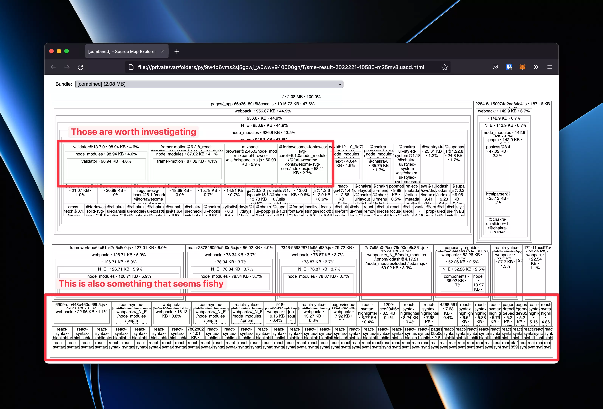

NextJS performances are pretty good out of the box. The framework supports code spitting and tries to create the most petite bundle possible.

However, as the project grows, so does the bundle. Next will still attempt to have a small bundle, but it cannot fix a poor implementation.

The list of defendants can vary depending on the size of the app. This article will focus on the following points: lodash imports, dependencies updates, proper methods, and components imports and dependencies optimization.

The end goal is to reduce the bundle size and have something as small as possible to make users and robots happy.

## Creating a baseline

Before doing any optimization, it’s best to start with a baseline. Having a base number is excellent since you’ll be able to see the effects of your actions. Besides, it helps justify the time you spent on this task that might look useless to the untrained eye.

I’ll be using a project we are working on at my current work since it didn’t see any optimization and is still reasonably straightforward. The project is built using NextJS 12, Chakra-UI, Fontawesome and contains many dependencies such as Lodash, DayJS, Mixpanel, Google Analytics…

To help with the analysis, I’ll be using the following dependencies and packages to analyze and visualize my bundle:

-   [GitHub - cyrilwanner/next-compose-plugins: 💡next-compose-plugins provides a cleaner API for enabling and configuring plugins for next.js ](https://github.com/cyrilwanner/next-compose-plugins)that helps manage plugins on next config file
-   https://github.com/josselinbuils/next-bundle-analyzer that will chart the bundle so we can see what takes space.
-   [GitHub - danvk/source-map-explorer: Analyze and debug space usage through source maps](https://github.com/danvk/source-map-explorer): helps visualize more precisely the content of the bundle. . This package can be globally installed.

Here is my current NextJS config file at the beginning of my investigations. Note that we’ll enable the source maps on the production of analysis, but this should be removed at the end.

```typescript
const withPlugins = require("next-compose-plugins");
const { withPlausibleProxy } = require("next-plausible");
const withBundleAnalyzer = require("@next/bundle-analyzer");

const plausiblePlugin = withPlausibleProxy;
const bundleAnalyzer = withBundleAnalyzer({ enabled: process.env.ANALYZE === "true" });

const nextConfig = {
    productionBrowserSourceMaps: true,
    i18n: {
        locales: ["en", "fr", "de"],
        defaultLocale: "fr",
        localeDetection: false,
    },
    reactStrictMode: true,
    images: {
        formats: ["image/avif", "image/webp"],
        domains: ["uploads-ssl.webflow.com", "images.unsplash.com"],
    },
};

module.exports = withPlugins([plausiblePlugin, bundleAnalyzer], nextConfig);
```

To use the next-bundle-analyzer library, we have to add the following command on the package.json: `"analyze": "ANALYZE=true next build"`.

It’s now possible to run the following commands to have the initial baseline:

-   `pnpm run build`: build the project and give information about the first JS load.
-   `pnpm run analyze`: will give a general idea of the repartition of the bundle.
-   `source-map-explorer .next/static//.js`: more in-depth information about the package.

Here are the numbers in my case:

-   2.23 MB bundle size with analyzing
-   2.08 MB bundle size with source maps
-   656 kB loaded with 1.9 MB resources on network inspector

On top of those numbers, I ran web.dev/measure tests 5 times to have an average performance score to see if we make any real-world improvements or if it’s just a smokescreen. I got an average of 69.2.


## Improving lodash imports

Loads is a pretty standard library, and the chances that it’s lying around in your project are pretty high. With 48 million downloads per week, the library is prevalent, and using it properly is critical and a fast fix.

The following image shows how optimizing imports can significantly impact the size of the files. There is a 10x factor depending on the method used when importing methods.

```typescript
import _ from "lodash"; // 73,13kB (gzip: 25,43kB)
import { isEmpty } from "lodash"; // 73,14kB (gzip: 25,43kB)
import isEmpty from "lodash/isEmpty"; // 7,04kB (gzip: 2,26)
```

We used the second method in our project since we thought it was better to do it. Changing imports is pretty fast, and it only took 5 minutes to make the change in the project.

-   2.17 MB bundle size with analyzing -2.691%
-   2.02 MB bundle size with source maps -2.885%
-   69.2 as average performance score 0
-   632 kB loaded with 1.8 MB resources on network inspector -3.659%

The changes are pretty marginal, but so is the effort, and this is why taking the time to make the improvements in the first recommended list.

## Use dynamic imports for non-essential UI elements

As said before, Next supports ES2020 dynamic imports. Instead of focusing on the server methods, this time, we’ll concentrate on dynamically importing the components that aren’t continuously displayed.

A modal, an error warning, and a function only triggered with user interaction are all elements that aren’t required by default. Dynamic imports provide a simple way to handle those cases.

The rule is pretty simple. Everything that is conditionally displayed can be dynamically imported. Look for all the `{VARIABLE && …` in your code, and you should see some components that can be changed.

```typescript
const ServiceBadge = dynamic(() => import(‘../Molecules/ServiceBadge’))

const ServiceHeader = ({service, title}: Props) => {
  const router = useRouter()
  const isMobile = useBreakpointValue([true, null, false], ‘base’)

  return (
    <HStack>
      <BackButton onClick={() => router.replace(ROUTE_ROOT)} />
      {isMobile && <ServiceBadge {…service} />}
      <Heading>{title}</Heading>
    </HStack>
  )
}

```

Besides, look at the methods that are executed on user inputs. Imports what they need inside them instead of at the top of the file. This way, you’ll only load the methods when you need them instead of every time.

```typescript
const handleLogout = async () => {
    await supabase.auth.signOut();
    setUser(null);
    const showToast = await import("../../utils/showToast").then((mod) => mod.showToast);
    showToast(keys.logout_success, "success");
};
```

-   2.21 MB bundle size with analyzing +1.843%
-   2.06 MB bundle size with source maps +1.980%
-   72 as average performance score +2.2
-   568 kB loaded with 1.6 MB resources on network inspector -10.127%

Dynamically importing the components has an enormous impact on the size of the loaded JS when opening the website. This simple change reduced the initial load by 10%, which is significant.

The reduction alone explains why the performance score improved by more than 2.2 points. Using dynamics imports definitely helps, and the result will be even more significant with a more complex page.

## Analyze the bundle

This step is the one that can have the most significant impact, and it’s also the one that can take the longest time since it will depend on many factors. Thanks to the bundle-analyzer and source-map-explorer, we have a clear view of what’s happening in the bundle and what could be changed.

There are two places to look at at this stage: if there is a large file imported and if there are a lot of small files. I don’t know how much an optimized bundle should weigh or how many files it should contain. For sure, both numbers should be as small as possible.

During my investigation, I discovered that some libraries were extensive and that react-syntax-highlight had a lot of files that were taking up a lot of space. You can see them in the following screenshots.



The analysis told me that I have to look at some libraries: validator, framer, mixpanel, fontawesome, and react-code-blocs.

I won’t go into too many details in this article, but here is a quick summary of what I did for every library:

-   validator: changed the way I import methods and use lodash `isEmpty` instead of the one from validator.
-   framer: did some vanilla animation for more specific elements and kept everything as it is for the more complex one.
-   mixpanel: removed the dependency since the data wasn’t used, and we had other tools for that
-   fontawesome: sadly, I wasn’t able to reduce the size of the imports
-   react-code-blocs: removed the library and directly used react-syntax-highlight instead since it was possible to only import what was required.

Besides those actions, I did some library cleaning and replaced them with vanilla TypeScript since they didn’t provide much improvement. I also took the time to update everything to its latest version in hopes of gains.

Finally, I performed some code analysis and removed the old and unused code. This step might not yield a smaller bundle, but it’s definitely positive for code quality and ease of use.

-   1,59 MB bundle size with analyzing -28,054%
-   1,45 MB bundle size with source maps -29,612%
-   73 as average performance score +1
-   489 kB loaded with 1,3MB resources on network inspector -13,908%

I had a feeling that this step would be the one that brought the most results, but I wasn’t expecting such an improvement! Shaving 30% of the bundle size by simply making smarter choices when it comes to library selection of feature implementation seems crazy.

## Do Not Use Server Data in useEffects

Next offers the possibility of fetching data on the server and using it on the client. This helps speed the page since data bandwidth is probably faster than your internet connection. Besides, having the data on page loads reduces the number of network calls.

Next, even offer the option to do incremental static generation, and it’s a feature I highly recommend since it allows near-instant page load while ensuring that data is fresh.

Getting data from the server on page loads or page build is excellent. However, it would be a shame to ruin those efforts and manipulate (or set a state) on the client.

Doing so means that the UI will be updated on the client where it should have been done on the server. This can result in a layout shift or poor performance.

Consider the following example. We fetch articles on the server, incrementally regenerate the page every 15 minutes (thanks to the `revalidate: 900` code).

However, we have a useEffect which is guaranteed to run on the client that sets a state where the article is saved. This is bad since Next won’t be able to build this page and have it pre-generated.

```typescript
export const getStaticProps = async () => {
  const fetchExamplePosts = (await import('./api/example-posts')).fetchExamplePosts
  const exampleArticles = await fetchExamplePosts()

  return {
    props: {
      exampleArticles,
      revalidate: 900,
    },
  }
}

const DisplayArticles = ({exampleArticles}) => {
  const [article, setArticle] = useState()

  useEffect(() => {
    setArticle(exampleArticles)
  }, [])

  return (
    <div>
      {!isEmpty(article) &&
        JSON.parse(article).map(post => {
          const temp = new ExamplePost(...post)
          return (
            <>
              
              <p>{temp.nameEn}</p>
            </>
          )
        })}
    </div>
  )
}

```

Instead, this is what should have been done. Directly access the data in the return statement, and the article will be present when the page is built on the server. Besides, this will benefit the performance score since the Cumulative Layout Shift will be reduced.

```typescript
export const getStaticProps = async () => {
  const fetchExamplePosts = (await import('./api/example-posts')).fetchExamplePosts
  const exampleArticles = await fetchExamplePosts()

  return {
    props: {
      exampleArticles,
      revalidate: 900,
    },
  }
}

const DisplayArticles = ({exampleArticles}) => {
  return (
    <div>
      {!isEmpty(exampleArticles) &&
        JSON.parse(exampleArticles).map(post => {
          const temp = new ExamplePost(...post)
          return (
            <>
              
              <p>{temp.nameEn}</p>
            </>
          )
        })}
    </div>
  )
}
```

One last note: it’s expected that some data must be manipulated on the client. However, there are cases where the data is fetched from an API and displayed (as it’s the case in the above examples. In those cases, please don’t manipulate the data on the client and directly display it si it will be present on page loads.

## Conclusion

The following table shows how our different actions impacted the bundle size or the performance score. Not every step has the same impact, and the results you might experience will significantly vary.


There are two apparent winners, using dynamic imports for UI elements that aren’t displayed by default and investigating the libraries that weigh down the bundle.

Dynamic imports are an excellent NextJS feature, and it allows for a more minor downloaded javascript. It was possible to reduce by 64 kB the JavaScript downloaded when loading the homepage, and the difference can be even more significant for more complex pages resulting in a near-instant page load.

Analyzing the bundle is by far the task that took me the longest. Fixing some libraries can result in lib change, making things harder. It’s important to stay rational and not spend countless hours trying to remove one library your project depends too much on.

I have to admit that improving lodash imports had a marginal impact. However, the size change will be dependent on how much the library is used on your project. Besides, it’s a quick job, and it would be a shame to not keep the old imports.

The investigations I conducted were quite exciting and helped me understand many things regarding Next and bundling. It was a fantastic learning experience that will benefit my team and our customer. I can already see room elements that have to change so we can deliver even faster websites!

I hope you find exciting elements and that you’ll be able to reduce the loading time of your website! Don’t hesitate to share other tips that I didn’t cover in this article. You can also register for my newsletter to receive an email when I publish a new article!
