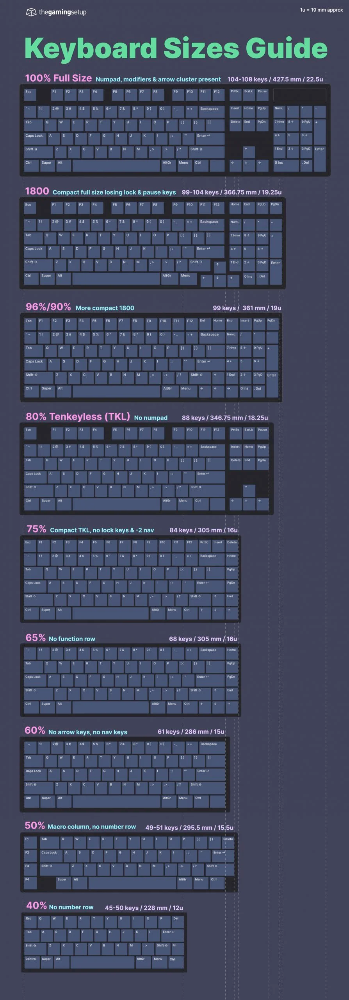

import { Tweet, Vimeo, YouTube } from "astro-embed";

It seems like the whole world is fighting to know which keyboard layout is the best. Every country has its own adaptation with a few changes. However, there is one clear winner for developers, the US ANSI QWERTY layout.

Keyboards are the main way we interact with computers and others, yet we don't think much about them. How strange?

## What's a keyboard layout?

Before diving into why the QWERTY layout is the best for developers, I feel like we need to discuss keyboard layouts.

There are many keyboard layouts, they could be “official” like the QWERTY in the US or Japan (and other countries), the AZERTY in France or the Thai Kedmanee in Thailand. Those layouts are broadly available in computers, smartphones settings or third party devices.

Besides that, there are “unofficial” keyboard layouts that have been developed over the years but are hard, if not impossible, to find in devices you can buy online. Most of them are used by a few people that takes typing very seriously.

### Why so many layouts?

In a world where technology is pretty standardized (internet without standardization would be a mess) it can seem strange that our keyboard aren't.

In a way it makes sense, keyboards predated computers and are present in the world for quite some time now. This is because computers keyboards are the little brothers of the typewriters.

Henry Mill got a patent for a typewriter in… 1714. Keyboards have been around for 300 years. At the time, the world was less standardized, and it makes sense that different countries ended up with different layout.

Besides that, languages are vastly different and having one layout for everybody would not be possible.

It also made sense that the first computers adopted the layout of the typewriter, since it was known by people. Computers offered more options than the typewriter, and the layout evolved with time to become what we know today.

<YouTube id="https://youtu.be/qLAqT2U68h4" />

### Three main keyboard family

Layouts are very different depending on country's languages. There are a lot of variation on the organisation of the key but no so much on their shape.

Modern computer follow one of three physical layouts, ISO, ANSI and JIS, At least something simple!

ISO layout has a split left shift key and the big enter. ANSI has the small 'return' key and a long key above. And JIS has a smaller space bar, some additional keys around it, the big 'return' and a smaller right shift.

Most people are able to switch from one layout to another (as long as the alpha key are the same), the biggest issue being the size of the return key for the ANSI layout.

### What about keyboard sizes?

As you see, there are many variations of the keyboard you know and love. But there is another layer to this, keyboard sizes.

I'm sure you all know and use several keyboard sizes every day without realizing it!

First there is the 100%, the full size keyboard which is composed of all the letters, the modifiers, the numeric pad and the function row. This is the biggest keyboard you can find in shops.

I feel like full size keyboard had their time and people start to use smaller keyboard thanks to our smartphones that are composed of a 40%! The smartphone keyboard is probably the smallest used by many, yet it's still completely possible to write texts.

This is thanks to layers that we all use every day. We can long press a key to access accent, or change layer with keys around the space bar. This is designed to circumvent the limitations of small keyboards.

Using a smaller keyboard on smartphones made people realized that having a full size keyboard is not required. People can ditch the num pad to get an 80% or a tenkeyless (TKL). Removing the function row results in a 65% and removing the arrow keys a 60%.

Of course there are smaller keyboards such as 40%, only composed of the alpha keys and the modifiers, but they are less common.

## What makes the US keyboard good

First, I don't want to say that the US keyboard is superior. This highly depends on the work you do, the language of your computer, and your personal preference.

However, I can argue that developers can highly benefit from using the standard QWERTY ANSI keyboard. This will not only make you more efficient, but will also make your life easier.

It's likely that the person that built the software you're using are either using the QWERTY layout or have a large chunk of their customer base using it. There is special care for this layout and other comes as a second thought.

Not convinced? Here are four reasons I think that the keyboard is better.

### Keys easily accessible

Let's start with the most obvious reason and the one that will make you hate your hold keyboard. Accessing keys used in programming is one (or two max) key press away.

Opening a square bracket ([]) is only one key press. For comparison, doing it on a French AZERTY keyboard requires pressing right alt and 5. The key is not marked, making it hard to find your mistake if you're sleepy. Worse, the closing bracket key is not next to the opening one, it's 6 key further down the keyboard!

Doing a curly bracket on QWERTY is shift and [] key. Simple and marked on the keyboard. Doing so on a Swiss keyboard is done with right alt and 8, again the key is unmarked.

I remember making mistakes and having to do some gymnastic with my fingers when I was using the Swiss layout. This is no longer the case, and I can confidently say that the QWERTY layout makes coding easier.

### All shortcuts working out of the box

I cannot count the number of keyboard shortcuts that weren't supported when I used my Swiss layout. For example, it was not possible to comment a line of code or a block of code in VS Code, since the software didn't recognize it.

Building a software is hard, but building an IDE or text editor must be a pain. Supporting a broad range of keyboard layout and adapt the shortcuts for each layout is a near impossible task. This is why some shortcuts simply don't work on some software, with luck you can bind the shortcut to something else, but if this is not the case you're screwed.

All that is without considering the time you'll lose configuring the software and the pain it is to use someone else computer. Spending time configuring keyboard shortcuts is not something I want to spend time one.

Switching to the QWERTY layout solved all my issue, sure I had to learn a few new shortcuts, but everything worked out of the box and I know more shortcuts than before.

### Easier to find help or follow guides

As for shortcuts, there is a high level chance that the documentation of the software you're using isn't localized. There are exception with bigger software that have the people and money required to make sure that everyone in the world can follow their guide.

Anyhow, chances are that you won't have documentation that follow your keyboard layout.

Again, using the US QWERTY layout will greatly help. The documentation I had to follow all used the standard US keyboard layout. In the rare instances I had to follow one I was able to solve my issue without any issue.

I admit that this is not something I do on a daily basis. However, when I have to follow a documentation that's because I'm in a pickle and finding myself blocked because of my keyboard layout is frustrating.

### More choice

You might have already tell but I like keyboards. They are part of those object from our every day life that are under appreciated and deserve a bit more love.

I like my MacBook keyboard but I also enjoy mechanical keyboards. They are a fantastic rabbit hole filled with people that will build their own mechanical keyboard and considering every aspect of it to make sure it's perfect (until they find something even more perfect).

Quite often the mechanical keyboard community will perform group by. Manufacturer have tight schedule and a minimum order size. Keyboards enthusiasts are part of a niche but there are many creative people that will design a keyboard case or a keycap set. They will then share their design online and if enough people are interested (to meet manufacturer limits) will turn their designs into reality.

This process is quite long but every manufacturer produces at full capacity all the time and the group buy must fit in one of the available slot. This is why it can take up to 2 or 3 years before seeing your set.

In the mechanical keyboard community the most common layout is the ANSI, every group buy will offer ANSI options. The same cannot be said about the ISO or JIS layout. If enough people are interested they will offer an option but there are no guarantee.

This is why, if you're interested in mechanical keyboard it makes sense to switch to this layout.

## My personal experience

I live in Switzerland, we have a QWERTZ layout that is quite similar to what the US QWERTY layout is. However, we use a ISO physical layout instead of the ANSI.

For a bit, I was convinced that the ISO layout was superior and that the big 'return' key is a good thing.

This all changed when I changed job. I joined Proton which is a tech company with employee across the world. To ease logistics, they gave me a US QWERTY keyboard. Without this job I would probably never have used a US keyboard.

### How was the switch

At first, I was a bit surprised; I was expecting a Swiss keyboard. The office manager offered me a Swiss keyboard but I declined since I have heard good things about the US keyboard and decided to give it a try before giving up.

Writing was quite easy, the alpha keys are very similar to the QWERTY layout. In about two day I was typing at my regular speed and only did some mistake while pressing the return key that was much smaller to the big one I was used to.

Coding was also easier but I had more muscle memories with those keys. I did quite a few mistakes at first and was frustrated. I even thought that the unmarked keys of the Swiss keyboard were a better solution.

With time I did less and less mistakes and I started to code even faster. All the key required to write code (at least in TypeScript / Javascript land) are very close and can be accessed with few modifiers.

After about two weeks I ordered a ANSI PCB (the card where the switch go) for my mechanical keyboard since it was hard for me to switch and I realized that the ANSI layout is superior.

### What is still hard

I work in an international company, meaning that we write most of our messages in english. However, I have quite a few coworkers that write to me in french.

French is full of accent and the US QWERTY keyboard don't support them. At least there are no dedicated keys for them. This is not that big of deal since all accent are available with keyboard shortcuts making it easy to use them. It's also possible to hope that the OS will put the accent for you but this is not working perfectly in my experience.

-   [macOS documentation](https://support.apple.com/guide/mac-help/enter-characters-with-accent-marks-on-mac-mh27474/mac?ref=flavienbonvin.com)
-   [Windows documentation](https://support.microsoft.com/en-us/topic/keyboard-shortcuts-for-international-characters-108fa0c1-fb8e-4aae-9db1-d60407d13c35?ref=flavienbonvin.com)

### Overall experience

I have to say that I was anticipating quite a painful switch but this was not the case at all. After a few days I was able to write at the same speed as before and after a couple of week I completely did the switch.

I currently still have my personal computer with the Swiss ISO layout and it's quite painful to use for coding. If I go out to work on side project or thinker with a new tool I will take my work computer simply because it's way nicer to code with the ANSI layout.

I'd like to point out that the switch was easy for me thanks to the similarities between the Swiss and US keyboard. Most of the keys are at a similar place.

The same cannot be said for my french coworkers used to the AZERTY layout. There are a lot of differences and most of my coworkers are using an external keyboards because it's too hard to change. On a side note, I find the French keyboard really bad and inefficient. I don't understand how they ended up with this layout. Maybe this could be traced back the the typewriter and the fact that they didn't want a layout similar to what the english had.

Anyhow, the US QWERTY keyboard is really nice and you should give it a try.

## Wrap up

I hope that this article put some perspective on why the US ANSI keyboard is great. It's a real productivity enhancement besides the ease of use it offers over other layouts.

Of course there might be some layout in the world that are close and offer the same benefits as what the US ANSI keyboard offer. If you're someone lucky enough to have this kind of layout you don't need this article to convince you I guess.

---

Know comes the question, how can I test this keyboard without having to change my laptop? I'm glad you ask!

Before diving in the unknown and making any significant change I would suggest two things:

-   If you have a keyboard using the ANSI layout: you're pretty much good to go. Simply go in your keyboard settings and change the layout to the US one, on macOS it's called "ABC"
-   If you have a ISO or JIS layout: don't change your laptop or buy an expensive mechanical keyboard. You can buy a cheap generic keyboard (such as the one Dell produce) and try the new layout this way. They are fairly cheap and will allow you to git the layout a spin. If you have a mechanical keyboard, it's possible that an ANSI version of the board exist (or you board already supports it). You can swap the board and test the ANSI layout this way.

Switching layout can be hard depending on where you're coming from. If you're french, for example, the transition will be painful but so was each republic yet you're at your fifth.

You'll have to spend about one or two week to get use to the new layout. I would highly suggest you to use this website to help the transition: https://www.keybr.com/. The website focus on muscle memory to help you learn to touch type. It's hard but efficient, the more you use it the easier it gets!

---

Here we are, at the end of this 2000 words high quality piece. If you read all the article this is probably because you either really like keyboard or like my writing style (or both).

Either way I'm happy to see that you read my article and I can only encourage you to subscribe to my newsletter so you'll have access to all my latest article right from your inbox!

No spam, no advertisement, just the article that you can read right from your inbox!
